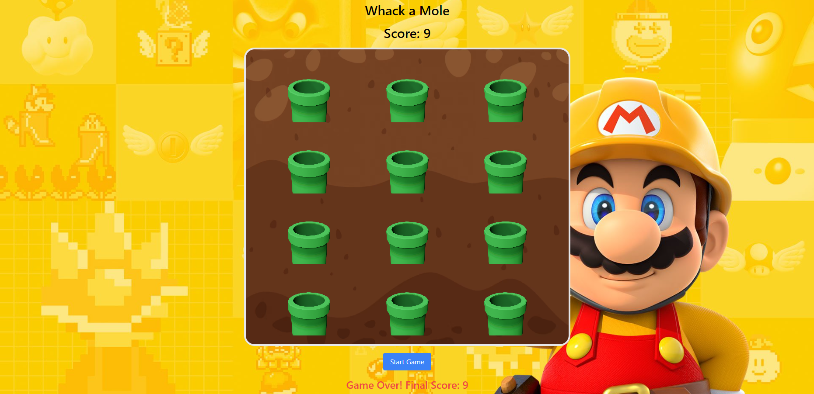

# Whack A Mole Game 🎮

Whack A Mole is a fun arcade game that tests players' speed and reflexes. Players try to earn points by hitting the moles that pop up on the screen.

  ## Demo  🌐
 [wack-a-mole-app.netlify.app](https://wack-a-molee10.netlify.app) 

### Screenshots 📸
<div style="display: flex; flex-direction: row;">
    
  
</div>

## Features ✨

- 📝 Players can earn points by quickly clicking on the moles that appear on the screen.
- ⏱️ Time-limited game mode encourages fast thinking and reaction skills.
- 🎯 Players earn points for each successful hit; missed hits result in a point loss.
- 🏆 High scores are recorded and displayed at the end of the game.


## Technologies Used 💻


- 💻 [React.js](https://reactjs.org/) - JS library for crafting user interfaces 
- 📦 [Vite](https://vitejs.dev/) - Module bundler 
- 🎨 [Tailwind CSS](https://tailwindcss.com/) - A utility-first CSS framework

## Installation 🛠️

- Install Node.js ⚙️
- Clone the repo 🔄

 📦 After cloning the repo install dependecies with

 ```sh 
    npm i && npm run dev
```
You can play the game by navigating to http://localhost:5173 in your browser. 🌐

## Usage 🚀

1. 📝 Players try to hit the moles by clicking the left mouse button as they appear on the screen. 
2. ⏳ When time runs out, the total score will be displayed on the screen.
3. 🎮 At the end of the game, players can see and record their highest score.


## License 📄

[MIT](https://choosealicense.com/licenses/mit/)


